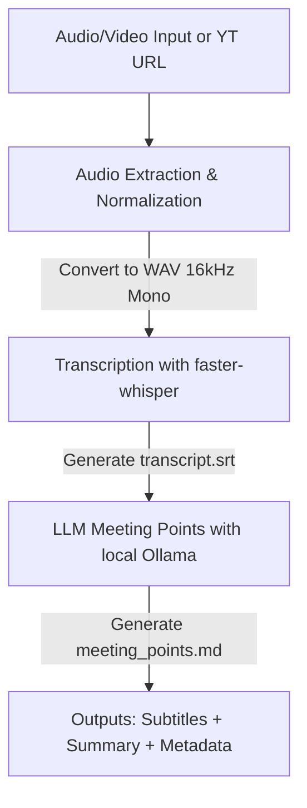

# Local Meeting Pipeline

A high-performance Python-based local pipeline to process meeting audio and video files, transcribe them, and extract meeting bullet points using local models.

---

## 🛠️ Architecture

The pipeline processes files end-to-end entirely on your local machine:



1. **Audio/Video Extraction & Normalization**: The input file (e.g., `.mp3`, `.mp4`, `.wav`, `.mkv`) or YouTube URL is processed via `ffmpeg` or `yt-dlp` to extract the audio channel and normalize it into a standard format: PCM 16-bit, 16000Hz, mono WAV.
2. **Transcription**: The normalized audio is transcribed using the **`faster-whisper`** library, generating a `.srt` subtitle file.
3. **Summarization (Local LLM)**: The transcript is fed to a local instance of **Ollama** (defaulting to the `gemma:2b` model) to construct structural meeting bullet points (Key Points, Decisions, Actions, and Pendencies) in Portuguese. Transcripts exceeding context windows are automatically chunked and consolidated.

---

## 📋 Prerequisites

Before running the pipeline, ensure you have the following installed on your system:

1. **Python >= 3.14**
2. **[uv](https://docs.astral.sh/uv/)** — Fast Python package installer and resolver.
3. **FFmpeg** — Required for audio extraction and format normalization.
   * *Linux*: `sudo apt install ffmpeg` (or your distro's package manager)
   * *macOS*: `brew install ffmpeg`
4. **yt-dlp** — Required for downloading audio from YouTube URLs.
5. **[Ollama](https://ollama.com/)** — Running locally with your model of choice pulled:
   ```bash
   ollama pull gemma:2b
   ```

---

## 🚀 Installation

Clone the repository and synchronize the environment using `uv`:

```bash
uv sync
```

This will automatically create a virtual environment, install all dependencies (including dev tools like `pytest` and `pyrefly`), and expose the CLI scripts.

---

## 💻 CLI Usage

Run the pipeline using `uv run`:

```bash
uv run meeting-pipeline --target <path_to_audio_or_video_file_or_youtube_url> [OPTIONS]
```

### Options

| Option | Type | Default | Description |
| :--- | :--- | :--- | :--- |
| `--target` | `str` | *Required* | Path to local media file or YouTube URL |
| `--output-dir` | `Path` | `output` | Directory where output files will be saved |
| `--whisper-model` | `str` | `small` | Whisper model size (`tiny`, `base`, `small`, `medium`, `large-v3`, etc.) |
| `--whisper-device` | `str` | `cpu` | Device to run Whisper inference on (`cpu` or `cuda`) |
| `--whisper-compute-type`| `str` | `int8` | Model quantization/compute type (`int8`, `float16`, etc.) |
| `--llm-model` | `str` | `gemma:2b` | Ollama model name to use for summarization |
| `--language` | `str` | `pt` | Language code for transcription (e.g., `pt`, `en`) |
| `--verbose` | `flag` | `False` | Enable debug logs |

### Examples

**Standard Audio Run:**
```bash
uv run meeting-pipeline --target sample.mp3 --whisper-model small --language pt
```

**YouTube URL Run:**
```bash
uv run meeting-pipeline --target "https://www.youtube.com/watch?v=dQw4w9WgXcQ" --whisper-model small --language pt
```

**Fast / Low-Resource Run:**
```bash
uv run meeting-pipeline --target sample.mp3 --whisper-model tiny --language pt --verbose
```

---

## 🐳 Docker & Docker Compose

You can also run the entire pipeline, including a local instance of Ollama, using Docker Compose.

### ⚙️ Configuration (CPU vs GPU)

Copy the `.env.example` template to `.env`:
```bash
cp .env.example .env
```

By default, `.env` is configured to run on **CPU**. If you have an NVIDIA GPU and want to enable GPU acceleration (using the overlay file `docker-compose.gpu.yaml`), edit the `.env` file and configure it as follows:
```env
# Enable GPU acceleration (uncomment this line and comment out the CPU-only one)
COMPOSE_FILE=docker-compose.yaml:docker-compose.gpu.yaml
```

Once `.env` is configured, you can run all Docker Compose commands normally without specifying `-f`.

### 🚀 How to Run

1. **Start the services**:
   ```bash
   docker compose up -d
   ```

2. **Execute the pipeline**:
   * **On CPU**:
     ```bash
     docker compose run --rm app --target sample.mp3 --whisper-model tiny --whisper-device cpu --language pt
     ```
   * **On GPU** (ensure GPU is enabled in `.env` and nvidia runtime is active):
     ```bash
     docker compose run --rm app --target sample.mp3 --whisper-model tiny --whisper-device cuda --language pt
     ```

The output files will be written directly to the host's `output/` directory. HuggingFace and Ollama caches are persisted in docker volumes so that subsequent runs do not re-download the models.

---

## 📁 Outputs

All outputs are saved to the designated `--output-dir` (default: `output/`):
* **`normalized.wav`**: The 16kHz mono audio track extracted/normalized from the input.
* **`transcript.srt`**: The full transcription in SubRip (.srt) format with timestamps.
* **`transcript_metadata.json`**: Metadata containing runtime parameters, detected language, and duration.
* **`meeting_points.md`**: Markdown document summarizing main points, decisions, actions, and pendencies in Portuguese.


---

## 🧪 Development & Quality Assurance

### Run Tests
A comprehensive suite of unit tests covers the CLI, transcription, normalization, and summarization modules. Run the registered test script:

```bash
uv run meeting-pipeline-test
```

### Code Formatting & Quality
Check lint rules using Ruff:
```bash
uv run ruff check
```

### Static Type Checking
Perform static analysis and type checking using the **Pyrefly** LSP/type checker:
```bash
uv run pyrefly check
```
