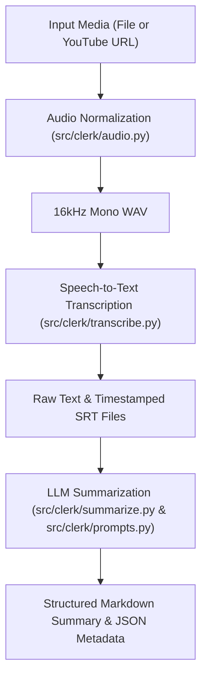

# `clerk` Documentation

Welcome to the technical documentation for **`clerk`**, a modern Python CLI application designed to automate audio extraction, high-accuracy speech-to-text (STT) transcription, and structured Portuguese LLM summarization from local media files or YouTube URLs.

---

## 🚀 High-Level Architecture Overview

The `clerk` pipeline coordinates four core stages sequentially:



---

## 📦 Core Modules Map

| Module | Location | Purpose & Primary Responsibilities |
|---|---|---|
| **Prompts & Strategies** | [`src/clerk/prompts.py`](modules/prompts.md) | CPU/GPU prompt strategy protocol, SRT timestamp cleaning, prompt injection protection (`<<<TRANSCRIPT>>>`), and noise guard rails. |
| **Speech-to-Text** | [`src/clerk/transcribe.py`](modules/transcribe.md) | `faster-whisper` (`BatchedInferencePipeline`) integration, VAD filtering, batching, and SRT subtitle formatting. |
| **Summarizer & Ollama** | [`src/clerk/summarize.py`](modules/summarize.md) | Ollama API communication, sentence/clause boundary chunking (`split_transcript_smart`), section parsing, and model memory unloading. |
| **Audio Processing** | [`src/clerk/audio.py`](modules/audio.md) | `ffmpeg` audio extraction to 16kHz mono WAV and `yt-dlp` YouTube downloads with title restriction. |
| **Pipeline Coordinator** | [`src/clerk/pipeline.py`](modules/pipeline.md) | Sequential pipeline execution, execution timing metrics (`hh:mm:ss:mm`), and JSON metadata export. |
| **CLI Application** | [`src/clerk/cli.py`](modules/cli.md) | Typer CLI commands, option validation (CPU vs GPU limits), presets (`cpu`, `fast`, `gpu`), and interactive model recovery menu. |

---

## 🛠️ Quick Developer Commands

```bash
# Run test suite
uv run clerk-test

# Run static type checker
uv run pyrefly check

# Run linter and code style check
uv run ruff check
```
