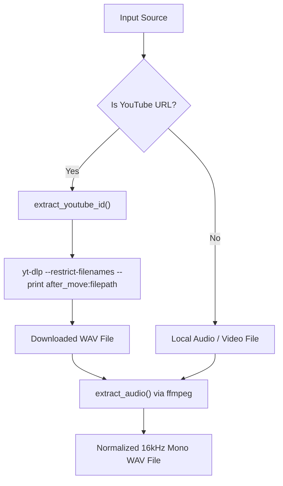

# Module: `src/clerk/audio.py`

The `audio` module handles external binary dependencies (`ffmpeg`, `yt-dlp`), YouTube audio extraction with human-readable video titles, and audio normalization into 16kHz mono WAV format.

---

## 🎯 Architectural Purpose



---

## 🛠️ Key Implementation Methods & Constants

### Constants
```python
DEFAULT_SAMPLE_RATE = "16000"
DEFAULT_CHANNELS = "1"
DEFAULT_AUDIO_CODEC = "pcm_s16le"
```

---

### `extract_youtube_id(url: str) -> str | None`
Extracts standard 11-character YouTube video identifiers across different URL formats using regular expressions:

```python
r"(?:v=|\/|embed\/|shorts\/)([a-zA-Z0-9_-]{11})"
```

**Supported URL Formats**:
- `https://www.youtube.com/watch?v=bWZndc9ycII`
- `https://youtu.be/bWZndc9ycII`
- `https://www.youtube.com/embed/bWZndc9ycII`
- `https://www.youtube.com/shorts/bWZndc9ycII`

---

### `download_youtube_audio(url: str) -> Path`
Downloads audio using `yt-dlp` while restricting filenames to filesystem-safe ASCII characters (`--restrict-filenames`) and returning the exact output file path (`--print after_move:filepath`).

---

### `extract_audio(input_path: Path, output_path: Path) -> Path`
Executes `ffmpeg` to extract and normalize audio streams into 16kHz mono PCM WAV format.

**Command Executed**:
```bash
ffmpeg -y -i <input_path> -vn -acodec pcm_s16le -ar 16000 -ac 1 <output_path>
```

---

## 📖 Public API Reference

| Function | Input Parameters | Return Type | Description |
|---|---|---|---|
| `ensure_ffmpeg` | None | `None` | Verifies `ffmpeg` binary exists in `PATH`. |
| `ensure_yt_dlp` | None | `None` | Verifies `yt-dlp` binary exists in `PATH`. |
| `extract_youtube_id` | `url: str` | `str \| None` | Extracts 11-character YouTube video ID. |
| `download_youtube_audio` | `url: str` | `Path` | Downloads YouTube audio using `yt-dlp`. |
| `extract_audio` | `input_path, output_path` | `Path` | Normalizes input file to 16kHz mono WAV using `ffmpeg`. |
