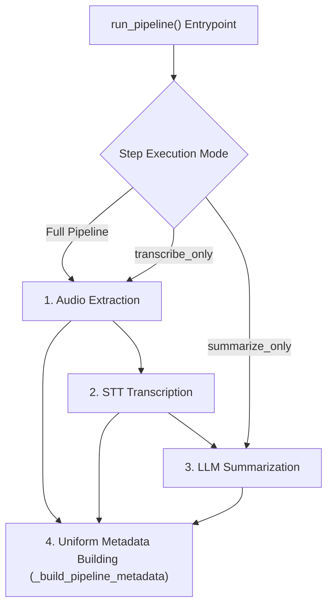

# Module: `src/clerk/pipeline.py`

The `pipeline` module orchestrates the sequential execution of audio extraction, Speech-to-Text transcription, and LLM summarization, tracking performance metrics and saving JSON metadata.

---

## 🎯 Pipeline Flow & Metadata Generation



---

## 🛠️ Key Implementation Methods

### `run_pipeline(...)`
Main orchestration entrypoint supporting full pipeline, `--transcribe-only`, and `--summarize-only` isolated step execution modes.

**Signature & Parameters**:
```python
def run_pipeline(
    input_path: Path,
    output_dir: Path,
    whisper_model: str,
    whisper_device: str,
    whisper_compute_type: str,
    llm_model: str,
    language: str | None,
    whisper_batch_size: int = 2,
    is_video: bool = False,
    verbose: bool = False,
    transcribe_only: bool = False,
    summarize_only: bool = False,
) -> tuple[Path | None, Path | None, dict]
```

### Isolated Step Modes:
- **`transcribe_only=True`**: Executes audio extraction and speech-to-text transcription. Skips LLM summarization (`summary_path` is `None`, `models.llm_model` is `"skipped"`).
- **`summarize_only=True`**: Reads transcript directly from `.srt` or `.txt` input files (auto-detected when target ends with `.srt`). Skips audio extraction and transcription (`models.whisper_model` is `"skipped"`).


**Output Naming Conventions**:
Based on `input_path.stem`:
- Normalized Audio: `<stem>_normalized.wav`
- SRT Subtitles: `<stem>_transcript.srt`
- Summary Document: `<stem>_resume.md` (`is_video=True`) or `<stem>_meeting_points.md` (`is_video=False`)
- Execution Metadata: `<stem>_metadata.json`

---

## 📊 Sample Metadata Schema (`<stem>_metadata.json`)

```json
{
  "language": "pt",
  "language_probability": 0.98,
  "duration": 485.2,
  "duration_after_vad": 450.1,
  "timings": {
    "audio_extraction_seconds": 1.25,
    "transcription_seconds": 12.45,
    "summarization_seconds": 5.10,
    "total_seconds": 18.80
  },
  "models": {
    "whisper_model": "large-v3",
    "whisper_device": "cuda",
    "whisper_compute_type": "float16",
    "whisper_batch_size": 8,
    "llm_model": "LiquidAI/lfm2.5-1.2b-instruct"
  },
  "word_counts": {
    "transcript_words": 1420,
    "summary_words": 280
  },
  "output_files": {
    "audio_path": "output/sample_normalized.wav",
    "transcript_path": "output/sample_transcript.srt",
    "summary_path": "output/sample_meeting_points.md",
    "metadata_path": "output/sample_metadata.json"
  }
}
```
