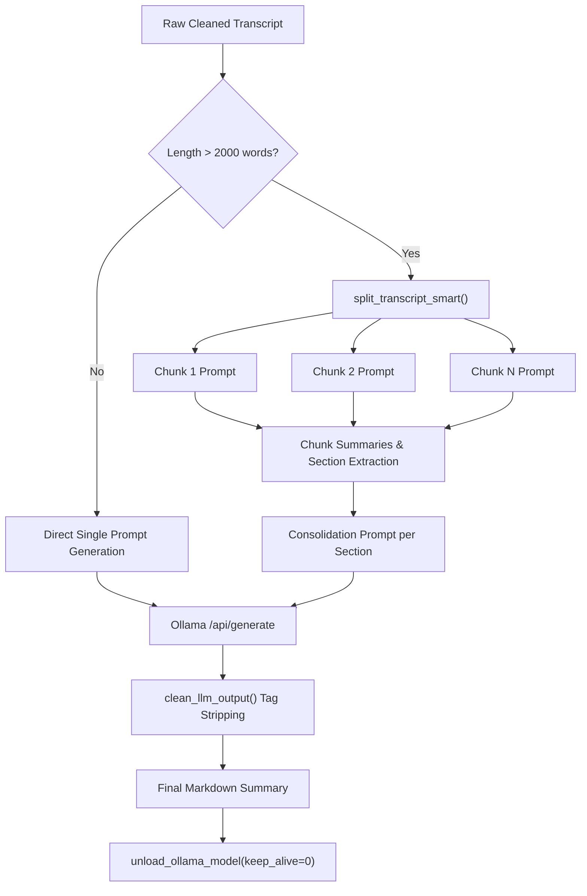

# Module: `src/clerk/summarize.py`

The `summarize` module communicates with local Ollama LLM instances (`http://127.0.0.1:11434`), performs smart sentence-boundary transcript chunking, parses section markdown headers, manages automatic model pulling, and unloads models from memory upon completion.

---

## 🎯 Architectural Purpose & Chunking Pipeline



---

## 🛠️ Key Implementation Methods & Functions

### `split_transcript_smart(transcript: str, max_words: int = 2000) -> list[str]`
Splits long transcripts without slicing through sentences, clauses, or words.

**Splitting Hierarchy**:
1. First splits transcript into clean line units and sentence boundaries using punctuation (`[.!?]`).
2. Accumulates sentences into chunks up to `max_words`.
3. If a single sentence exceeds `max_words`, breaks the sentence along clause boundaries (`,;:`).
4. If a clause still exceeds `max_words`, performs word-level splitting as a final fallback.

---

### `get_summary_config(is_video: bool) -> SummaryConfig`
Returns required section names based on content mode:

- **Meeting Mode (`is_video=False`)**:
  - `## Pontos principais` (Primary Section)
  - `## Decisões`
  - `## Ações`
  - `## Pendências`

- **Video Mode (`is_video=True`)**:
  - `## Resumo geral` (Primary Section)
  - `## Principais tópicos`
  - `## Momentos importantes`
  - `## Conclusões ou mensagens finais`

---

### `_call_ollama_generate(prompt, model_name, base_url, timeout_seconds) -> str`
Handles HTTP communication with Ollama:
1. Posts prompt payload to `/api/generate` (`stream=False`).
2. If HTTP 404 or "model not found" is returned, automatically posts to `/api/pull` to download the missing model.
3. Resumes generation once pulled successfully.
4. Passes the raw LLM response string through `clean_llm_output(...)` to guarantee no `<<<...>>>` tags leak into the final output.

---

### `unload_ollama_model(model_name, base_url, timeout_seconds=10.0)`
Frees GPU/CPU memory by sending a post request with `"keep_alive": 0` to Ollama immediately after summarization completes:

```python
payload = {"model": model_name, "keep_alive": 0}
client.post("/api/generate", json=payload)
```

---

## 📖 Public API Reference

| Function | Input Parameters | Return Type | Description |
|---|---|---|---|
| `split_transcript_smart` | `transcript, max_words=2000` | `list[str]` | Boundary-aware transcript chunker. |
| `parse_summary_sections` | `summary, is_video=False` | `dict[str, list[str]]` | Parses section bullet points. |
| `summarize_transcript` | `transcript, model_name, base_url, timeout_seconds, max_words_per_chunk, language, is_video, is_gpu_model` | `str` | Main entrypoint for transcript summarization. |
| `unload_ollama_model` | `model_name, base_url, timeout_seconds=10.0` | `None` | Unloads model from Ollama VRAM/RAM. |
