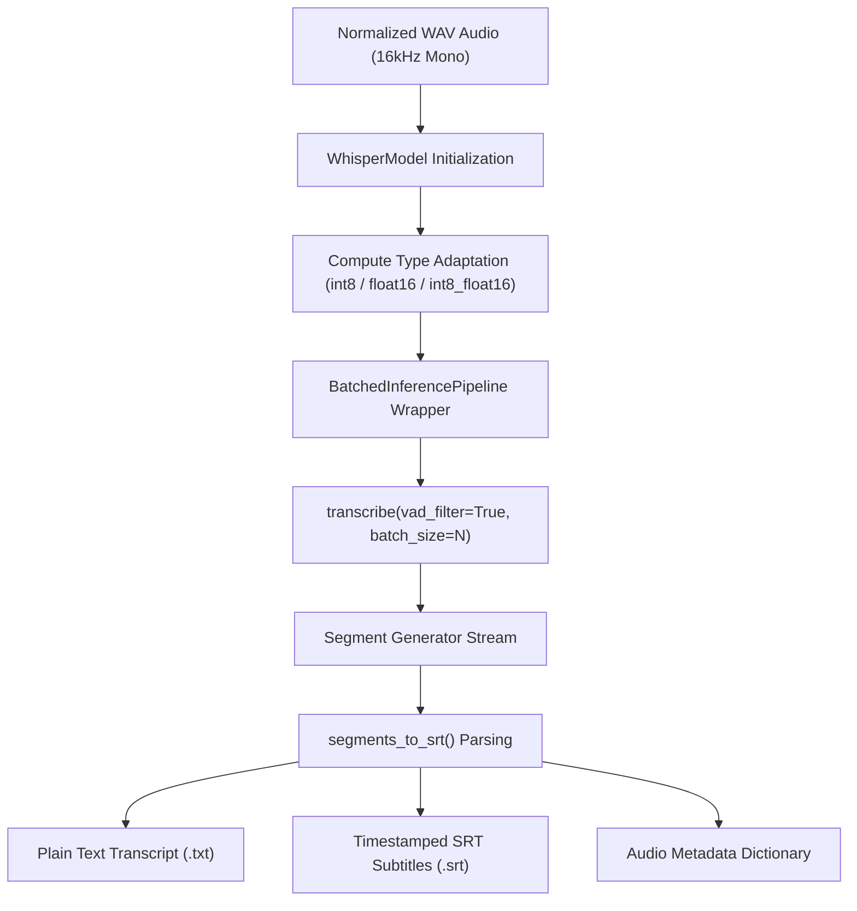

# Module: `src/clerk/transcribe.py`

The `transcribe` module provides high-performance Speech-to-Text (STT) capabilities powered by `faster-whisper` (`BatchedInferencePipeline`). It handles model loading, compute type adaptation, Voice Activity Detection (VAD) filtering, SRT timestamp block creation, and transcription progress logging.

---

## 🎯 Architectural Purpose & Engine

`transcribe.py` interfaces with CTranslate2 C++ backends via `faster-whisper` to execute accelerated neural ASR inference:



---

## 🛠️ Key Implementation Methods & Functions

### `format_timestamp(seconds: float) -> str`
Converts floating-point duration in seconds into standard SRT timestamp strings (`HH:MM:SS,mmm`).

**Constants**:
- `MS_PER_HOUR = 3_600_000`
- `MS_PER_MINUTE = 60_000`
- `MS_PER_SECOND = 1000`

**Code Implementation**:
```python
def format_timestamp(seconds: float) -> str:
    total_ms = round(seconds * MS_PER_SECOND)
    hours, remainder = divmod(total_ms, MS_PER_HOUR)
    minutes, remainder = divmod(remainder, MS_PER_MINUTE)
    secs, ms = divmod(remainder, MS_PER_SECOND)
    return f"{hours:02d}:{minutes:02d}:{secs:02d},{ms:03d}"
```

**Example Output**:
`125.45` $\rightarrow$ `"00:02:05,450"`

---

### `segments_to_srt(segments: list) -> tuple[str, str]`
Processes segment objects yielded by `faster-whisper`, filtering empty text lines and generating sequential 1-based index SRT blocks.

**Return Value**:
Returns a tuple `(plain_text, srt_text)`:
- `plain_text`: Multiline string of spoken sentences without timestamps.
- `srt_text`: Formatted SRT subtitle document.

**Example SRT Block**:
```text
1
00:00:00,000 --> 00:00:02,500
Olá, bem-vindos à reunião de alinhamento.
```

---

### `transcribe_file(...)`
Main entrypoint for transcribing an audio file.

**Signatures & Parameters**:
```python
def transcribe_file(
    audio_path: Path,
    model_name: str = "small",
    device: str = "cpu",
    compute_type: str = "int8",
    language: str | None = "pt",
    batch_size: int = DEFAULT_BATCH_SIZE,
    verbose: bool = False,
    log_progress: bool = True,
) -> tuple[str, str, dict]
```

**Key Execution Features**:
1. **File & Argument Validation**: Validates that `audio_path` exists and `batch_size >= 1`.
2. **Compute Type Adaptation**: If `compute_type == "int8"` and `device` is GPU (`cuda`), automatically upgrades compute type to `"int8_float16"` for CTranslate2 GPU compatibility.
3. **Batched Pipeline Execution**: Wraps `WhisperModel` in `BatchedInferencePipeline` for parallelized multi-segment audio inference.
4. **VAD Filtering**: Enables `vad_filter=True` to automatically remove silent stretches and background noise before model evaluation.
5. **Progress Bar Display**: Sets `log_progress=True` by default, displaying a progress bar during transcription even when `verbose=False`.

---

## 📖 Public API Reference

| Function | Input Parameters | Return Type | Key Exceptions |
|---|---|---|---|
| `format_timestamp` | `seconds: float` | `str` | N/A |
| `segments_to_srt` | `segments: list` | `tuple[str, str]` | N/A |
| `transcribe_file` | `audio_path, model_name, device, compute_type, language, batch_size, verbose, log_progress` | `tuple[str, str, dict]` | `FileNotFoundError`, `ValueError` (batch_size < 1), `RuntimeError` (empty transcript) |
